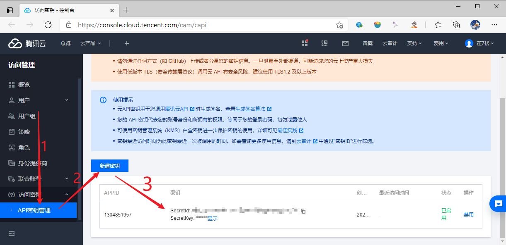
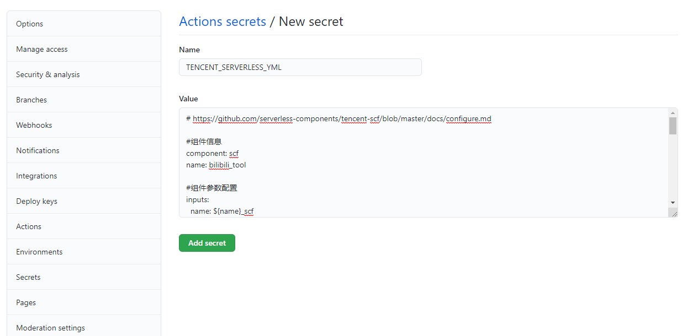
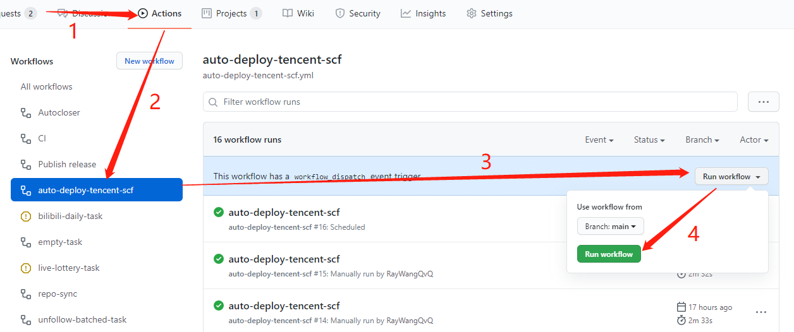
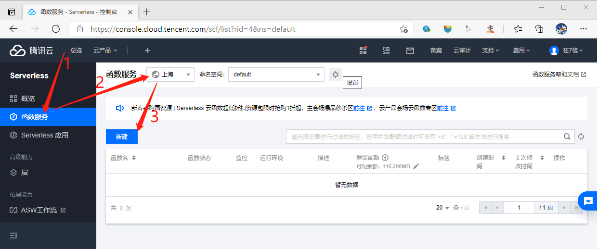
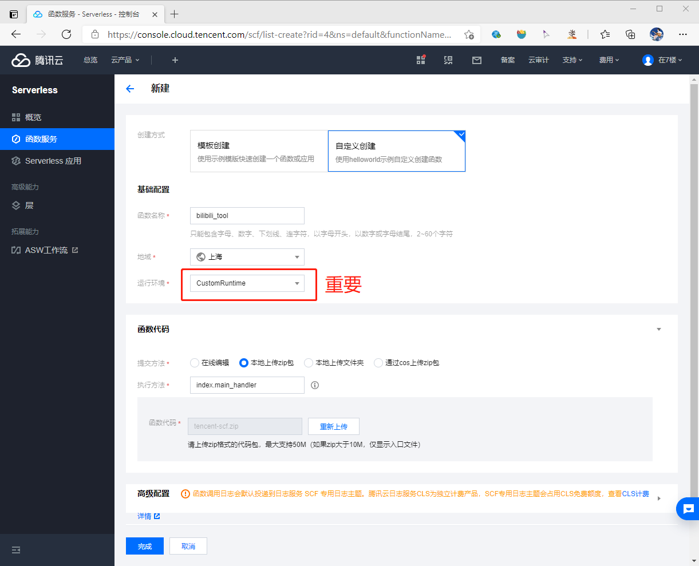
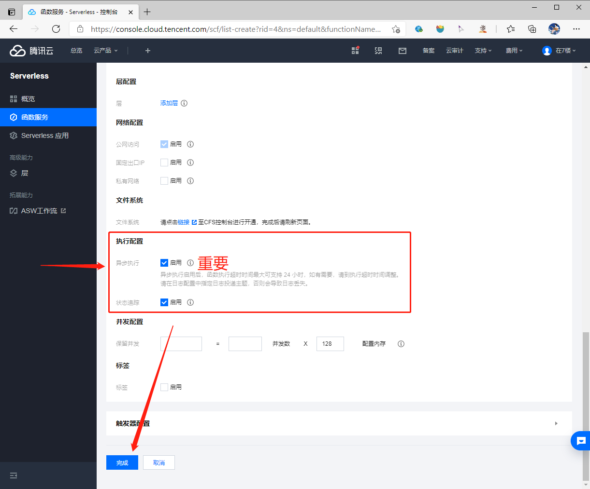
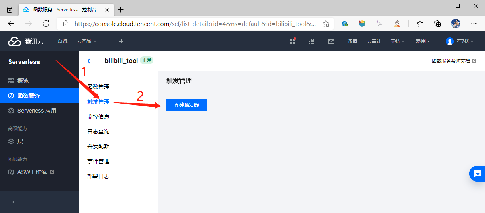
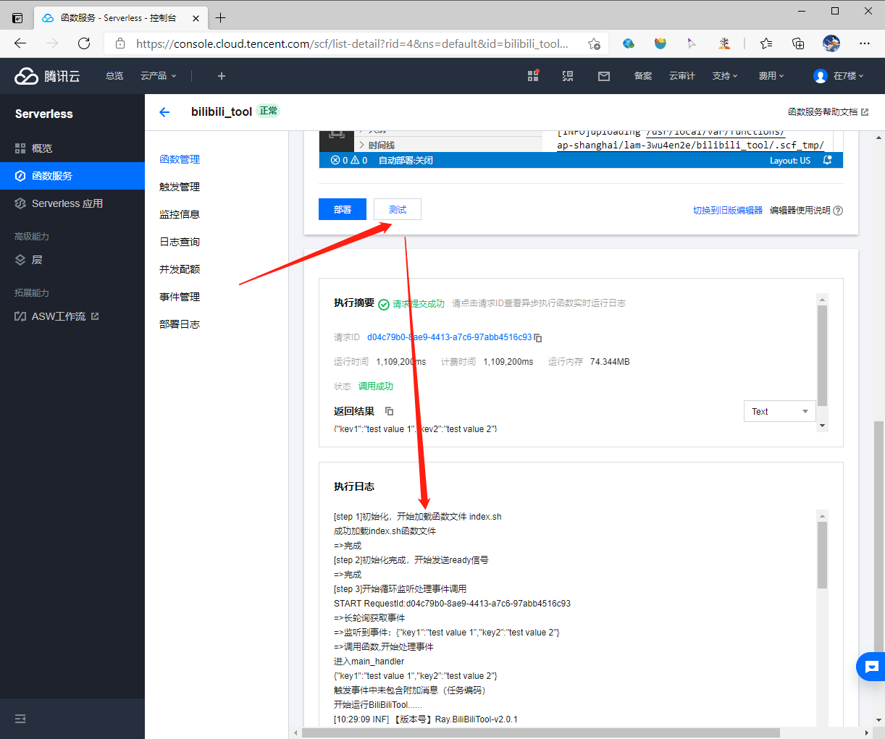

# 腾讯云云函数（SCF）部署说明
<!-- TOC depthFrom:2 -->

- [1. 介绍](#1-介绍)
- [2. 注册账号](#2-注册账号)
- [3. 部署](#3-部署)
    - [3.1. ~~方式一：Actions自动部署~~（暂时不再支持）](#31-方式一actions自动部署暂时不再支持)
        - [3.1.1. 复刻本仓库到自己的GitHub仓库](#311-复刻本仓库到自己的github仓库)
        - [3.1.2. 到腾讯云获取密钥](#312-到腾讯云获取密钥)
        - [3.1.3. 通过 Secrets 添加配置](#313-通过-secrets-添加配置)
            - [3.1.3.1. 密钥相关配置](#3131-密钥相关配置)
            - [3.1.3.2. 云函数配置](#3132-云函数配置)
            - [3.1.3.3. 自动定时更新部署配置](#3133-自动定时更新部署配置)
        - [3.1.4. 手动执行Actions](#314-手动执行actions)
        - [3.1.5. 测试云函数](#315-测试云函数)
    - [3.2. 方式二：上传zip包部署](#32-方式二上传zip包部署)
        - [3.2.1. 下载压缩包到本地](#321-下载压缩包到本地)
        - [3.2.2. 云函数控制台新增函数服务](#322-云函数控制台新增函数服务)
        - [3.2.3. 手动运行测试](#323-手动运行测试)
        - [3.2.4. 配置触发器，设定运行时间和频率](#324-配置触发器设定运行时间和频率)
- [4. 测试](#4-测试)

<!-- /TOC -->

## 1. 介绍
见[腾讯云官网](https://cloud.tencent.com/document/product/583)

## 2. 注册账号
注册成功后，需要激活云函数 SCF 功能。因为会赠送免费额度，所以正常使用是免费的。

## 3. 部署
以下两种方式任选一个适合自己需求的即可。
### 3.1. ~~方式一：Actions自动部署~~（暂时不再支持）
因为代码仓库没了，所以该方式暂时不再支持，请跳到下一节。

该方式可以实现自动定期部署，保证代码始终的最新版本的。
#### 3.1.1. 复刻本仓库到自己的GitHub仓库
点击本 GitHub 仓库右上角的 `Fork` 按钮，复刻本项目到自己的仓库。

#### 3.1.2. 到腾讯云获取密钥
[官方对授权的说明](https://cloud.tencent.com/document/product/1154/43006)

手动部署时，可以通过扫描二维码来进行授权。但为了避免人工的重复授权，我们将采用密钥授权的方式，步骤如下：

**Ⅰ.登录腾讯云后，点击进入[腾讯云密钥管理](https://console.cloud.tencent.com/cam/capi)页面**

如果提示创建子账号，可以先拒绝。简单起见，直接使用主账号创建即可。

**Ⅱ.点击新建密钥按钮，创建一个密钥。复制并保存 `SecretId` 和 `SecretKey` 两项内容，待会儿会用到它们**

如下图所示：

#### 3.1.3. 通过 Secrets 添加配置
进入自己 fork 的仓库，点击 Settings-> Secrets-> New repository secret，添加如下 Secrets 作为配置：

##### 3.1.3.1. 密钥相关配置
这两个配置决定了会部署到哪个腾讯云账户的 SCF 下面。

| 配置名称 | Name | Value |
| :----: | :----: | :----: |
| Id | `TENCENT_SECRET_ID` | 刚才在官网获取到的 SecretId |
| Key | `TENCENT_SECRET_KEY` | 刚才在官网获取到的 SecretKey |

##### 3.1.3.2. 云函数配置
Actions 使用 `Serverless Framework` 来部署，通过 `serverless.yml` 来配置函数信息（如函数应用名称、区域、环境变量和触发器等）。

配置步骤如下：

**Ⅰ.拷贝或下载 [serverless.yml](./serverless.yml) 文件内容到本地文件中，开始编辑内容**

其中主要需要改的是最下方的环境变量，这些环境变量在部署后会添加到云函数中（即云函数控制台看到的环境变量集合），它们将作为应用配置传入bilibili_tool

其中 cookie 是必填项，其他应用配置的也可以通过添加相应的环境变量实现，建议自己添加UA、推送等配置。（配置信息请参考[配置说明文档](../docs/configuration.md)）

其他 `serverless.yml` 可选配置内容请参考[官方说明](https://github.com/serverless-components/tencent-scf/blob/master/docs/configure.md)

**Ⅱ.拷贝修改后的内容，将其整个添加到 secrets 中**

| 配置名称 | Name | Value |
| :----: | :----: | :----: |
| serverless.yml内容 | `TENCENT_SERVERLESS_YML` | 刚才拷贝的整个文件内容 |

如下图所示：

##### 3.1.3.3. 自动定时更新部署配置

添加如下配置开启自动定时部署：

| 配置名称 | Name | Value |
| :----: | :----: | :----: |
| 定时自动部署 | `IS_AUTO_DEPLOY_TENCENT_SCF` | true |

自动部署只是定时会将自己仓库的代码部署到云函数，想要自动更新，还需要开启仓库的自动同步，详见常见问题文档中的 《我 Fork 之后如何同步原作者的更新内容？》章节

#### 3.1.4. 手动执行Actions
在自己仓库页面，依次点击 Actions ——> auto-deploy-tencent-scf ——> Run workfolw ,手动触发部署工作流。

如下图所示：

#### 3.1.5. 测试云函数
如果部署成功，那么登录自己的腾讯云函数控制台，就可以看到对应的函数应用了。

请参考下节《测试》进行手动测试函数运行。

### 3.2. 方式二：上传zip包部署
该方式比较简单直观，但是代码是上传是固定版本，想更新的话需要再次手动上传。
#### 3.2.1. 下载压缩包到本地
点击[BiliBiliTool/release](https://github.com/RayWangQvQ/BiliBiliTool.Docs/releases)，选择最新版本的 `tencent-scf.zip` ，下载到本地
#### 3.2.2. 云函数控制台新增函数服务
**Ⅰ.进入[云函数控制台](https://console.cloud.tencent.com/scf/)，单击左侧导航栏【函数服务】，进入“函数服务”页面。顶部地域选择一个靠近自己地址的，点击新建按钮。**

如下图：

**Ⅱ.填写基本信息**
* 创建方式：选择自定义创建
* 函数名称：bilibili_tool
* 地域：刚才已经选过了
* 运行环境：CustomRuntime
* 函数代码提交方式：本地上传zip包
* 执行方法：index.main_handler
* 函数代码：点击后选择之前本地下载好的zip包

如下图：

**Ⅲ.点击展开高级配置，添加配置**
* 初始化超时时间：30
* 执行超时时间：86400（会警告超范围，先不用管，下面开启异步之后就好了）
* 环境变量（这里先加 2 个配置就行了，后续可以再添加其他的）：
    * cookie 配置：key 为 `Ray_BiliBiliCookies__1` ， value 为之前浏览器抓取到的cookie字符串
    * 随机睡眠配置：key 为 `Ray_Security__RandomSleepMaxMin` ，value 为 `0` （为了方便测试，所以先关掉，后面测好之后再删掉该配置，或者自己改一个value值）

如下图：

**Ⅳ.继续下滚，找到执行配置模块：**
* 异步执行：勾选启用
* 状态追踪：勾选启用

如下图：

**Ⅴ.点击完成按钮，创建函数**

触发器配置先不用管，可以等测试完成后再添加

#### 3.2.3. 手动运行测试
参考下节《测试》进行手动测试。

#### 3.2.4. 配置触发器，设定运行时间和频率
**Ⅰ.点击左侧【触发管理】导航，点击“创建触发器”按钮**

如下图：

**Ⅱ.填写触发器信息**
* 触发方式：定时触发
* 定时任务名称：DailyTask
* 触发周期：自定义触发周期
* Cron表达式：自己根据需求指定，10 15 * * * 表示每天15点10分运行，不会的可以做下搜索工作，规则很简单
* 附加信息：是
* 信息内容：`Daily`
* 立即启用：勾选启用
填完后点击提交按钮提交，即可完成。如下图：

这里的附加信息将作为runTasks（欲运行的任务编码）配置，通过命令行传入程序。想多个任务共用一个触发器的话，可以使用&号拼接任务编码，填入附加信息，如 `Daily&LiveLottery`

等到触发器设定的时间，对应的触发器就会去运行应用，自动完成任务。

## 4. 测试

**Ⅰ.成功部署好函数后，会看到如下的函数管理页面，点击顶部函数代码 Tab 页，准备测试。**

如下图：

**Ⅱ.下拉，找到测试按钮，点击运行测试，页面下方会同步显示日志。如果运行正常，则表示部署已成功。**

如下图:

